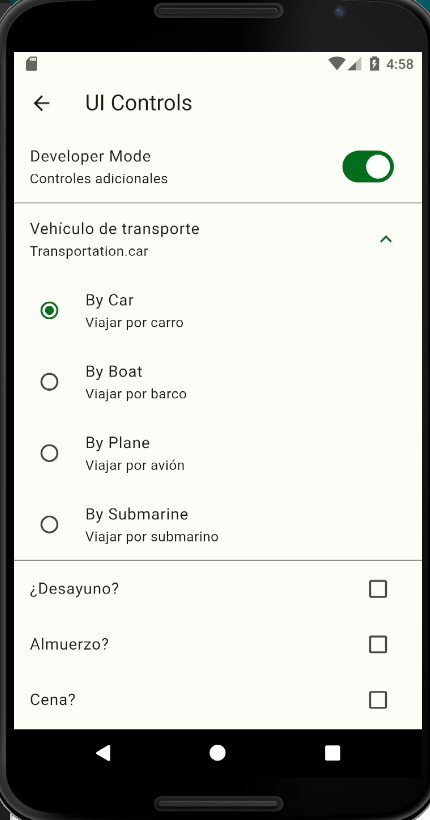

# Widgets App


**Widgets App** is a sample Flutter application that utilizes a wide range of widgets to provide an educational experience in mobile app development. This application also uses **Riverpod** as a state management solution to maintain a clean and scalable code architecture.

## Features

- Intuitive and attractive user interface.
- Educational examples of using various Flutter widgets.
- Implementation of Riverpod for state management.

## Screenshots





## Installation

1. Clone this repository on your local machine:

   ```bash
   git clone https://github.com/brunoBrizo/flutter-widgets-riverpod.git
   ```

2. Navigate to the project directory:

   ```bash
   cd flutter-widgets-riverpod
   ```

3. Run the following command to fetch the dependencies:

   ```bash
   flutter pub get
   ```

4. Connect your device or start an emulator.

5. Launch the application:

   ```bash
   flutter run
   ```

## Project Structure

```
|-- lib
|   |-- config
|   |   |-- ...
|   |-- presentation
|   |   |-- ...
|   |-- main.dart
|-- assets
|   |-- images
|   |   |-- ...
|-- screenshots
|   |-- screenshot1.png
|   |-- screenshot2.png
|-- pubspec.yaml
|-- README.md
```

Enjoy exploring the different widgets and learning with Widgets App!
